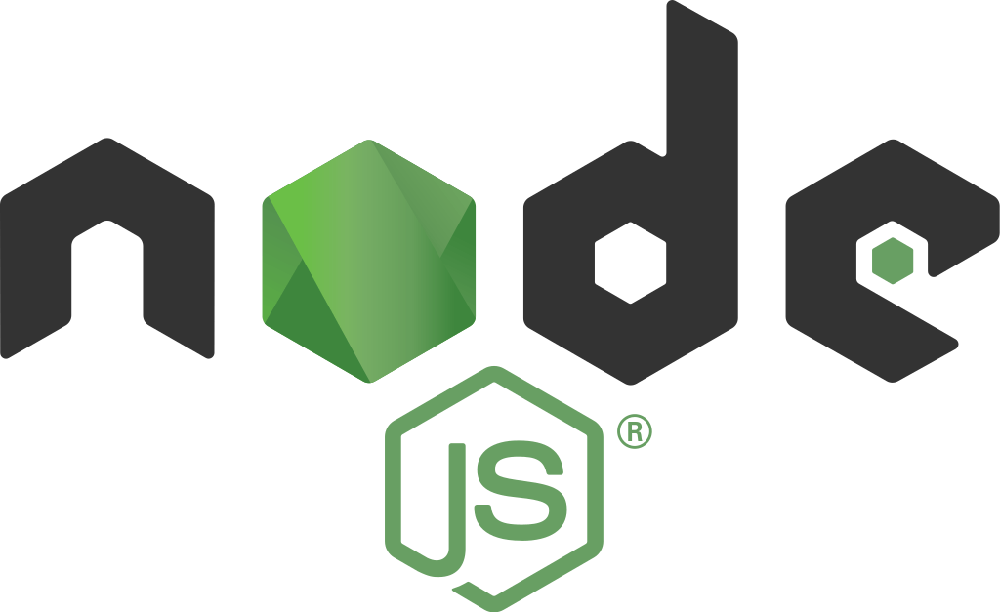
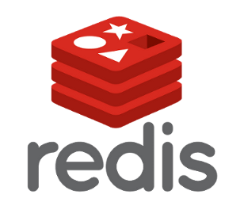

### Hi there 👋
### Hello World :computer:

- 🔭 I’m currently studying at <a href="https://www.utbm.fr">UTBM</a> in France after an bachelor degree at <a href="http://shu.admissions.cn/">Shanghai University </a>  
- :rocket: Currently learning about Full Stack Development.
- :mortar_board: Bachelor in Software Dev from <a href="http://shu.admissions.cn">SHU</a>. 

### 🛠️Skills :floppy_disk:

<!--
**AlexandreSuperCC/ASCC** is a ✨ _special_ ✨ repository because its `README.md` (this file) appears on your GitHub profile.

Here are some ideas to get you started:

- 🔭 I’m currently working on ...
- 🌱 I’m currently learning ...
- 👯 I’m looking to collaborate on ...
- 🤔 I’m looking for help with ...
- 💬 Ask me about ...
- 📫 How to reach me: ...
- 😄 Pronouns: ...
- ⚡ Fun fact: ...
-->
